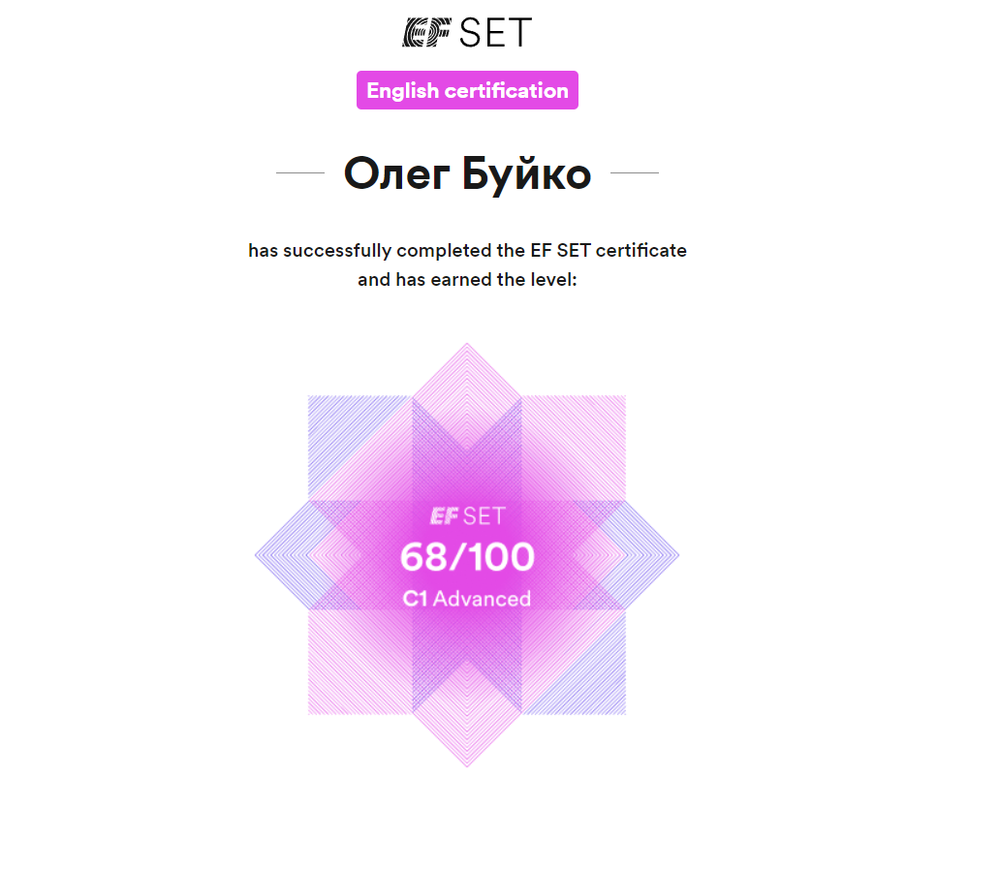

# Oleg Buiko
-----------------------------------------------------------------------
# Contacts
* Phone: +375 44 111-55-55
* email: oleshkabyiko@gmail.com
* [LinkedIn](https://www.linkedin.com/in/oleg-buiko-0b995b290/)
* GitHub - [olezhaaa137](https://github.com/olezhaaa137)
* Discord - olegbuiko
----------------------------------------------------------------------------
## About myself:

I am a fourth-year student at the Belarusian State University of Informatics and Radioelectronics, majoring in Information Systems and Technologies. I have a strong passion for Java application development and I am eager to pursue a career in this field while continuously expanding my knowledge of new technologies. As a motivated individual, I thrive on tackling complex problems and finding innovative solutions. I am excited about the opportunity to contribute as an intern or junior Java backend developer.
----------------------------------------------------------------------------------

## Skills

- **Java**
- **HTML5, CSS3**
- **Git, GitHub**
- **Maven**
- **Spring MVC basics**

--------------------------------------------------------------------------------------------
## Code Example:

Very simple, given a number (integer / decimal / both depending on the language), find its opposite (additive inverse).

```

public class Kata
    {
        public static int opposite(int number)
        {
            // your code here
          return number * -1;
        }
    }

```
----------------------------------------------------------------------------------------------------

## Experience

-------------------------------------------------
## Education

* Belarusian State University of Informatics and Radioelectronics (engineer-programmer-economist)

## English 

* *Advanced* (accroding to the [EFSet](https://www.efset.org/) test)
